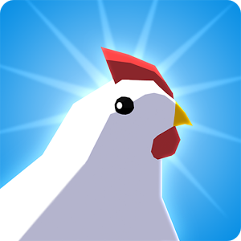

***

# Egg, Inc.

# By:

### Top

# `README.md`

***

# Index

[00.0 - Top](#Top)

[01.0 - Index](#Index)

[02.0 - Description](#SeansLifeArchive_Images_Egg_Inc.)

[03.0 - About](#About)

[04.0 - Wiki](#Wiki)

[05.0 - Version history](#Version-history)

[06.0 - Contributers](#Contributers)

[07.0 - Issues](#Issues)

> [07.1 - Current issues](#Current-issues)

> [07.2 - Past issues](#Past-issues)

> [07.3 - Past pull requests](#Past-pull-requests)

> [07.4 - Active pull requests](#Active-pull-requests)

[08.0 - Resources](#Resources)

[09.0 - Contributing](#Contributing)

[10.0 - About README](#About-README)

[11.0 - README Version history](#README-version-history)

[12.0 - Footer](#You-have-reached-the-end-of-the-README-file)

***

# SeansLifeArchive_Images_Egg_Inc.
The module for my life story project that contains my Egg, Inc. gameplay images. Started; March 5th 2021.

***

## About

See above. This repository hosts all mt daily/weekly Egg Inc. session pictures. I currently play the [Android version)](https://play.google.com/store/apps/details?id=com.auxbrain.egginc&hl=en&gl=US) although if you are on iOS, you can get it [here](https://apps.apple.com/us/app/egg-inc/id993492744)

These daily pictures are to be used for progress monitoring, but can also be used as stock images. You can learn more about Egg Inc. by [clicking/tapping here (Wikipedia page)](https://en.wikipedia.org/wiki/Egg,_Inc.). You can download an APK through APKPure if you are fine with dealing with hCaptcha [APKPure link](https://apkpure.com/egg-inc/com.auxbrain.egginc)

***

## Wiki

[Click/tap here to view this projects Wiki](https://github.com/seanpm2001/SeansLifeArchive_Images_Egg_Inc./wiki)

***

## Version history

Unavailable

[More versions coming soon](https://www.example.com)

***

## Contributers

Currently, I am the only contributer. Contributing is not allowed, as this is a personal project.

> * 1. [seanpm2001](https://github.com/seanpm2001/) - 47 commits (As of Friday, March 5th 2021 at 5:30 pm)

> * 2. No other contributers.

***

## Issues

### Current issues

None at the moment.

### Past issues

None at the moment.

### Past pull requests

None at the moment.

### Active pull requests

None at the moment

***

## Resources

Here are some other resources for this project:

[Project language file](PROJECT_LANG.vala)

[Egg Inc. on the app store](https://apps.apple.com/us/app/egg-inc/id993492744)

[Download an APK of Egg, Inc. using APKPure](https://apkpure.com/egg-inc/com.auxbrain.egginc)

### Images

[Egg,_Inc._app_cover.png (PNG)](Egg,_Inc._app_cover.png)

No other resources at the moment.

***

## Contributing

Contributing is not allowed for this project, as it is a personal project.

[Click/tap here to view the contributing rules for this project](CONTRIBUTING.md)

***

## About README

File type: `Markdown (*.md)`

File version: `1 (Friday, March 5th 2021 at 5:30 pm)`

Line count: `0,202`

***

## README version history

Version 1 (Friday, March 5th 2021 at 5:30 pm)

> Changes:

> * Started the file

> * Added the title section

> * Added the index

> * Added the about section

> * Added the Wiki section

> * Added the version history section

> * Added the issues section.

> * Added the past issues section

> * Added the past pull requests section

> * Added the active pull requests section

> * Added the contributors section

> * Added the contributing section

> * Added the about README section

> * Added the resources section

> * Added the README version history section

> * No other changes in version 1

Version 2 (Coming soon)

> Changes:

> * Coming soon

> * No other changes in version 2

***

### You have reached the end of the README file

[Back to top](#Top) [Exit](https://github.com)

***
